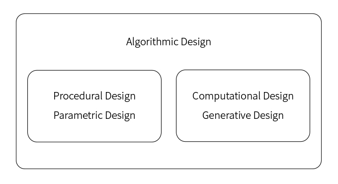
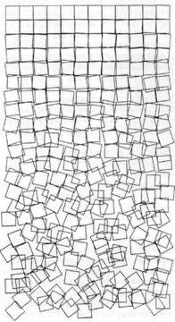
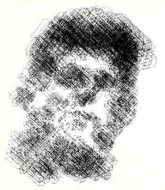
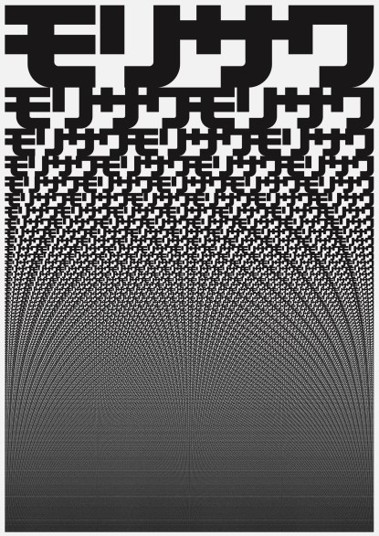
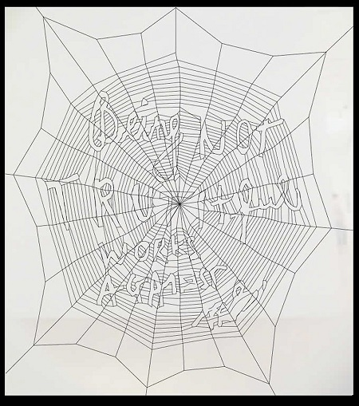

# コンピュータを用いて制作を行う  

Algorithmic Design, Procedural Design, Parametric Design, Computational Design, Generative Design  

CGや、建築デザインにおいて、コンピュータを用いた制作に関係するキーワードとしてこういうものがある。  
いくつかのいまどきキーワードを事例やコンピュータの歴史を見ながら、考えてみる。少し進めてみたところで、とりあえず、現状こんな感じかという図を書いた。  

  

まず Algorithmic Design はちょっと扱いにくいように思える。でかい。  

左の2つは、手の延長ともいえる。  
建築分野で言うと、古くは丹下研究室、最近では　SANAA が、大量の~~奴隷~~スタッフを用いて、  
形状が少しずつ異なる模型を大量に作って、リーダーが比較し選んでいくというスタディがとられている。  
パラメータを用いて、設計変更可能なモデルを作るのと似ている。洗い出し、的な。  

右の2つは、脳の進化といえる（のだろうか）。  
数式や、ランダム、さらには、高度な解析やコンピュータパワーなど、デザインの最終イメージに対してコンピュータが大きな比重を占める（占めないものもある）。  

という解釈をいったんしてみる。(190113)  

---  

---  

# いくつかの作品をピックアップしてみる  

### Schotter / Georg Nees (1960s)  

1960 年代に、ランダム等を組み合わせたアルゴリズムを用いて制作されたもの。  

  

---  

### Kennedy / CTG (1967)  

Computer Technique Group(1966-69)  
幸村真佐男、槌屋治紀、山中邦夫、柿崎純一郎を中心に結成。  

日本IBMの大型計算機（IBM7090）と、CALCOMP社のプロッタ（CalComp563）を深夜に利用して、CG作品を制作した。  

[http://www.systemken.com/ctg.html](http://www.systemken.com/ctg.html)  

  

---  

### Morisawa 10 / John Maeda (1996)  

コンピュータ（アルゴリズム）を用いて作られているものとして、まずあげるならこれとか。  
Processing の前身、Design By Numbers の開発者でもある、グラフィックデザイナー、ジョン前田のモリサワのポスター。  

[https://maedastudio.com/morisawa-10-2016/](https://maedastudio.com/morisawa-10-2016/)  

中村勇吾がアルゴリズムについてのテキストの中でこのように書いている  
>グラフィックデザイナーのジョン前田は、1980～90年代にコンピュータープログラミングを用いた様々なグラフィック表現を創造したが、彼の作品集「Maeda@Media」（2001）では、プロセスのおびただしい反復や、繊細かつ厳密な多様性、といったコンピューターアルゴリズムによってしか実施できないような表現手法を模索し、そこに新しい美学を見出そうとする態度（Aesthetics of Computation）が表明されていた。  

  

---  

### Being Not Truth / Ralph Ammer and Stefan Sagmeister (2006)  

シミュレーションを用いた平面デザインで挙げられるのは、有名なのはこれとか（有名な本で取り上げられている）。  
くもの巣のシミュレーション。  

  

プロジェクションされている壁面の前を通ると、くもの巣と干渉し、伸びたり絡まったり千切れたりするインタラクションがある。  

  
（↑ jump to youtube）  

イベントでいうと、  
2006年には、多摩美術大学美術館で開催された「20世紀コンピュータ・アートの軌跡と展望 －現代アルゴリズム・アートの先駆者・現代作家の作品・思想－」という展示会があった。  
[http://www.tamabi.ac.jp/museum/exhibition/061103.htm](http://www.tamabi.ac.jp/museum/exhibition/061103.htm)  

---  

---

### 中村勇吾が AXIS に書いていたアルゴリズムについてのテキスト  

>"アルゴリズム”  
ある「手順・プロセス」を「定式化」し、他者が「利用・展開」できるように設計された単位を、アルゴリズムと呼ぶ。  
現代では主にコンピュータプログラミングにおける「思考と制作の単位」となっているが、本来の定義においてはこの限りではなく、グラフィックデザインや映像表現その他の分野においてもアルゴリズム、つまり定式化されたプロセスの利用に軸を置いた表現は散見される。  
映像作家のノーマン・マクラレンは、1950～70年代に数多くの実験的アニメーションの名作を残したが、その代表作のひとつ「カノン」に見られるように、例えば「前に進む→前に進む→右に進む → …」といった単純な「手順」を多様に展開すること、つまりアルゴリズムが表現の軸の一つに据えられていた。  
グラフィックデザイナーのジョン前田は、1980～90年代にコンピュータープログラミングを用いた様々なグラフィック表現を創造したが、彼の作品集「Maeda@Media」（2001）では、プロセスのおびただしい反復や、繊細かつ厳密な多様性、といったコンピューターアルゴリズムによってしか実施できないような表現手法を模索し、そこに新しい美学を見出そうとする態度（Aesthetics of Computation）が表明されていた。  
上記のような典型的な例でなくとも、私たち誰もが一般的に行う思考や制作の中には多くのアルゴリズムが潜んでいる。普段、私たちがなんらかの手順やプロセスであると捉える全ての事象は、何らかのかたちで取り出され定式化され再利用される、つまりアルゴリズム化され得る可能性を孕んでいる。  
現代のコンピューターソフトウェア技術は飛躍的に進化し、一般に「人工知能」「機械学習」と呼ばれるような、人間の認知や思考に似た複雑なプロセスをアルゴリズム化する領域にまで及んでいる。  
「なにかが新しくアルゴリズム化された」ということは「そこに新しい思考や制作の単位が生まれた」ということと等しい。その後、このような現象に特に敏感な制作者たちによって、新しい単位の新しい利用法が次々に編み出され、共有されることで、私たちの表現可能領域は徐々に拡張していく。  
「カノン」が利用した単純明快な「手順」から、人工知能のような高度化・複雑化したアルゴリズムへと時代は変わり続ける中、表現とアルゴリズムはこのような関係をずっと続けているようだ。

---  
