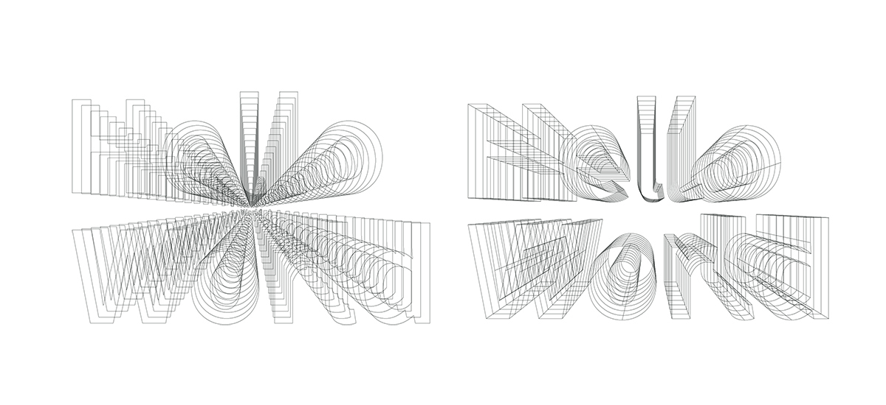
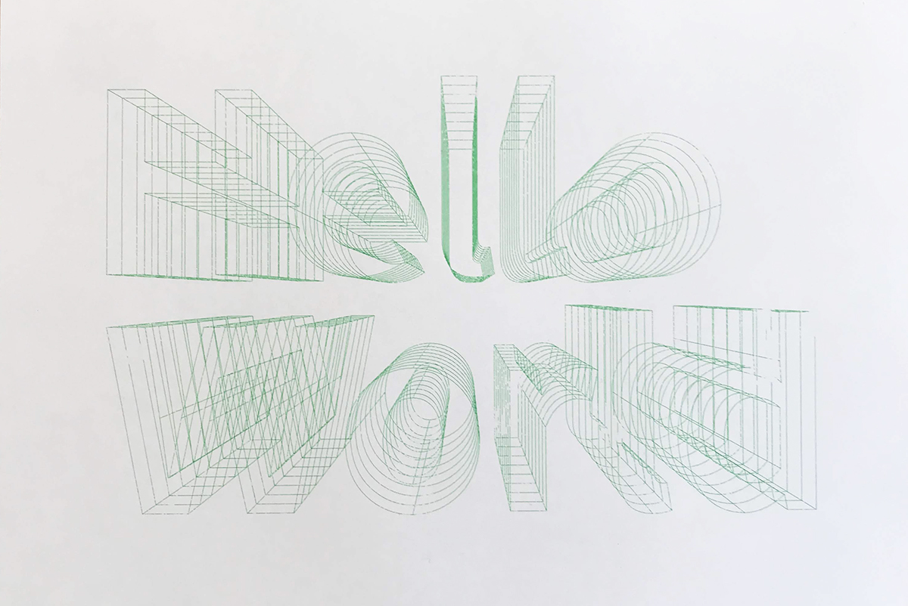
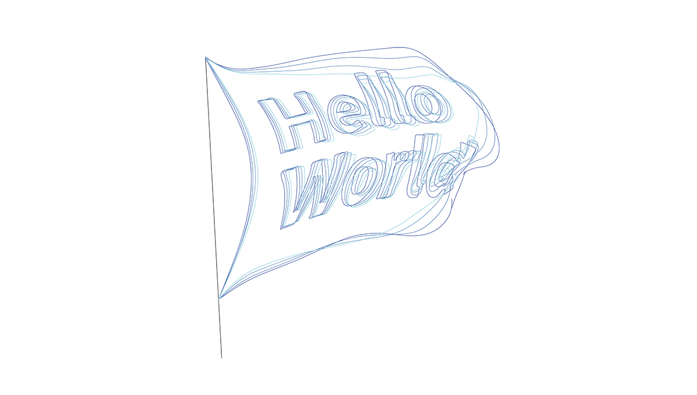

# AlgorithmicDesign-for-GraphicDesign  

コンピュータを用いて制作を行う（ことについての美学？）。  

アルゴリズミックデザインとか呼ばれるものとかを考える。  

シミュレーション / シミュレーション風の違い、それに対する態度とか気分とか、研究と合わせてちょっとなんか書く。  

- 研究メモ制作メモ（[Aesthetics.md](https://github.com/naysok/AlgorithmicDesign-for-GraphicDesign/blob/master/Aesthetics.md)）  

- 自動処理スクリプトメモ（[Make2d-ExportAiFile.md](https://github.com/naysok/AlgorithmicDesign-for-GraphicDesign/blob/master/Make2d-ExportAi-scripts/Make2d-ExportAiFile.md)）  

---

---  

# それぞれのシリーズについて  

手仕事の延長の上から3つと、1番下の脳の進化（置き替え?）の1つ。  

- Outline-Outline-Outline  
- Hellooooo-Wooooorld  
- Text-Metaball-Contouring  
- WindSimulation  

---  

### Outline-Outline-Outline  

クソ年賀状シリーズ。  
パチンコ屋の広告の文字感、Microsoft Office で変に頑張りすぎた文字感。  

  

ベース文字の Futura の O とか、! マークとかすごくいい感じ。  

イラレで文字のアウトライン化、パスのアウトライン化を繰り返す。  
手のレタリングでもできることはできるが面倒。Adobe Illustrator の機能を、手で繰り返し操作することでこうなる。  
Illustrator をはじめとする Adobe のソフトウェアは、ニューメディアの言語の中で、諸原則として挙げられる「低次」の自動化の最たるものと言える。  

---  

### Hellooooo-Wooooorld  

反復シリーズ。  
Grasshopper で、テキストのアウトラインに奥行きをつけた。  

  

ペンプロッターで書いた。  
書いてみると、画面で見るのとはまた違う、ぼやけているみたいな感じが出たので良かった。  

  

ジョン前田のモリサワの反復のあれこれの真似をちまちましていたところ、線画で綺麗に成立しそうなの、がこれとか。  
反復シリーズはもう少し攻めれると思う。  

---  

### Text-Metaball-Contouring  

---  

### WindSimulation  

物理シミュレーションシリーズ。  
とりあえず、脳の進化系、Computational Design, Generative Design を用いたデザインと位置付けてみる。  
与条件を作って、形状はコンピュータの計算結果に任せる。  

  

シミュレーションはこんな感じ。  
サーフェスのモーフィングは重いので、シミュレーションとは切り離す方が良さそう。  
あとで、Make2d で線画にするなら、サーフェスで。  

  

パラパラ漫画にしたい、かも。  

---  
