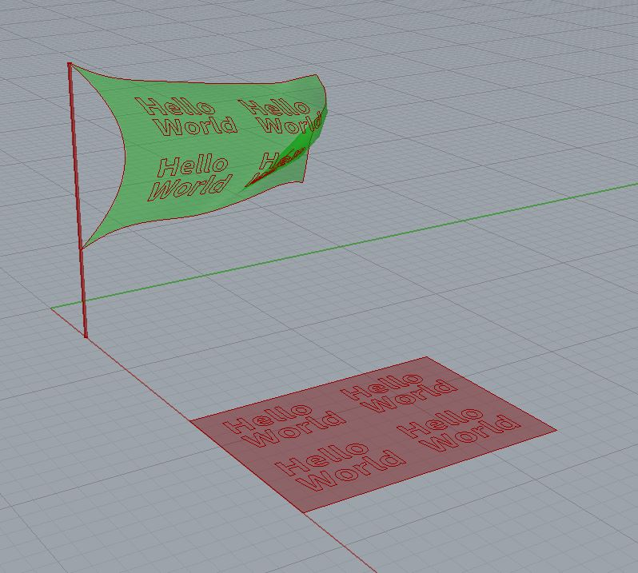

# Simulation-for-GraphicDesign  

### Wind Simulation /w Kangaroo2  

サーフェスのモーフィングは重いので、シミュレーションとは切り離す方が良さそう。  

あとで、Make2d でみるなら、サーフェスで。  

  

---  

---  

### Ref  

シミュレーションを用いた平面デザインで挙げられるのは、有名なのはこれとか。  

### Being Not Truth / Ralph Ammer and Stefan Sagmeister (2006)  

くもの巣のシミュレーション  

  

プロジェクションされている壁面の前を通ると、くもの巣と干渉し、伸びたり絡まったり千切れたりするインタラクションがある。  

  
（↑ jump to youtube）  

---  
