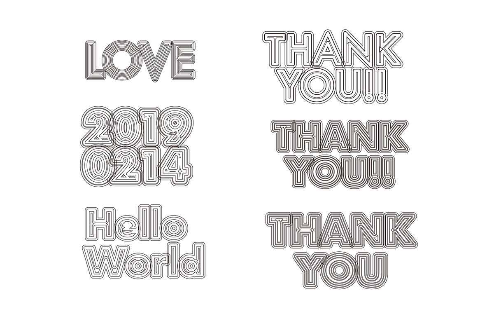
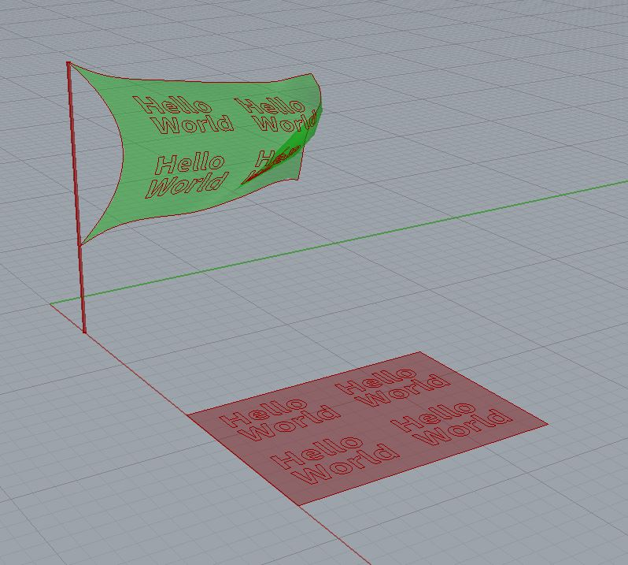

# AlgorithmicDesign-for-GraphicDesign  

コンピュータを用いて制作を行う。  

アルゴリズミックデザインとか呼ばれるものとかを考える。  

シミュレーション / シミュレーション風の違い、それに対する態度とか気分とか、研究と合わせてちょっとなんか書く。  

- 研究メモ制作メモ（[https://github.com/naysok/AlgorithmicDesign-for-GraphicDesign/blob/master/Aesthetics.md](https://github.com/naysok/AlgorithmicDesign-for-GraphicDesign/blob/master/Aesthetics.md)）  

- 自動処理スクリプトメモ（[https://github.com/naysok/AlgorithmicDesign-for-GraphicDesign/blob/master/Make2d-ExportAi-scripts/Make2d-ExportAiFile.md](https://github.com/naysok/AlgorithmicDesign-for-GraphicDesign/blob/master/Make2d-ExportAi-scripts/Make2d-ExportAiFile.md)）  

---

---  

### Outline-Outline-Outline  

クソ年賀状シリーズ。  
パチンコ屋の広告の文字感、Microsoft Office で変に頑張りすぎた文字感。  

  

ベース文字の Futura の O とか、! マークとかすごくいい感じ。  

イラレで文字のアウトライン化、パスのアウトライン化を繰り返す。  
手のレタリングでもできることはできるが面倒。Adobe Illustrator の機能を、手で繰り返し操作することでこうなる。  
Illustrator をはじめとする Adobe のソフトウェアは、ニューメディアの言語の中で、諸原則として挙げられる「低次」の自動化の最たるものと言える。  

---  

### Helooooo-Wooooorld  

---  

### Text-Metaball-Contouring  

---  

### WindSimulation  

/w Kangaroo2  

サーフェスのモーフィングは重いので、シミュレーションとは切り離す方が良さそう。  

あとで、Make2d でみるなら、サーフェスで。  

  

---  
