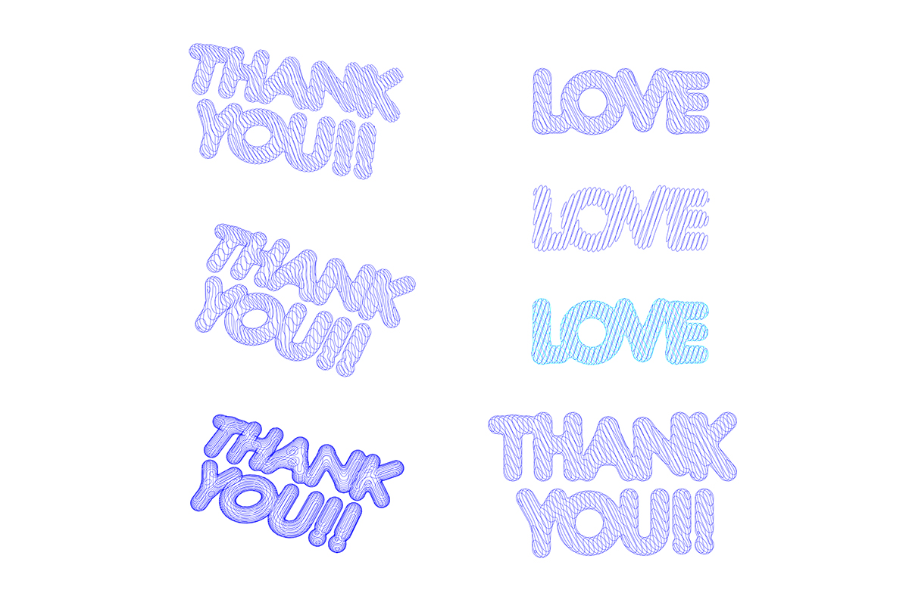

# AlgorithmicDesign-for-GraphicDesign  

コンピュータを用いて制作を行う（ことについての美学？）。  

アルゴリズミックデザインとか呼ばれるものとかを考える。  

操作する決定するのは誰なのか、シミュレーション / シミュレーション風の違い、それに対する気分とか研究と合わせてなんか書く。  

- 研究メモ制作メモ（[Aesthetics.md](https://github.com/naysok/AlgorithmicDesign-for-GraphicDesign/blob/master/Aesthetics.md)）  

- 自動処理スクリプトメモ（[Make2d-ExportAiFile.md](https://github.com/naysok/AlgorithmicDesign-for-GraphicDesign/blob/master/Make2d-ExportAi-scripts/Make2d-ExportAiFile.md)）  

---

---  

# それぞれのシリーズについて  

手仕事の延長の上から3つと、1番下の脳の進化（置き替え?）の1つ。  

- Outline-Outline-Outline  
- Hellooooo-Wooooorld  
- Text-Metaball-Contouring  
- WindSimulation  

---  

### Outline-Outline-Outline  

クソ年賀状シリーズ。  

パチンコ屋の広告の文字感、Microsoft Office で変に頑張りすぎた文字感。  

  

ベース文字の Futura の O とか、! マークとか良い感じ。  

イラレで文字のアウトライン化、パスのアウトライン化を繰り返す。  
手のレタリングでもできることはできるが面倒。Adobe Illustrator の機能を、手で繰り返し適用することでこうなる。（反復シリーズとも言えてしまう？）  
Illustrator をはじめとする Adobe のソフトウェアは、ニューメディアの言語の中で、諸原則として挙げられる「低次」の自動化の最たるものと言える。（雑すぎるので要追記）  

---  

### Hellooooo-Wooooorld  

反復シリーズ（Scaling）。  

Grasshopper で、テキストのアウトラインをスケール変更の操作をスクリプトによって繰り返し、奥行きのような表現をつけた。  

  

ペンプロッターで書いた。  
書いてみると、画面で見るのとはまた違う、残像のような感じが出たので良かった。  

  

ジョン前田のモリサワの反復のあれこれの真似をちまちましていたところ、線画で綺麗に成立しそうなの、がこれとか。  

反復シリーズはもう少し攻めれると思う。  

---  

### Text-Metaball-Contouring  

シミュレーション風シリーズ（アルファベットの風船）。  

（良い意味で）バカっぽい、安っぽいアルファベットの風船。  
ベースの形状はマーチングキューブによるメタボールで作る。膨らみ丸さの表現としてコンターで切ってみる。  

  

（良い意味で）バカっぽい、安っぽいアルファベットの風船（[Google 画像検索](https://www.google.com/search?q=Alphabet+Balloon&source=lnms&tbm=isch&sa=X&ved=0ahUKEwj7xuXlt_rfAhXNA4gKHaMKCMAQ_AUIDigB&biw=1298&bih=889&dpr=1.5)）  

  

風船のシミュレーションが面倒なので、シミュレーション風で作る。 その違いとは。

検索結果と比べると、（良い意味での）バカっぽさ、安っぽさが足りない。  
（良い意味での）バカっぽさ、安っぽさの不足は、シミュレーション / シミュレーション風の作り方の違いによるではないけれど。  

---  

### WindSimulation  

シミュレーションシリーズ（風と布）。  

とりあえず、脳の進化系、Computational Design, Generative Design を用いたデザインと位置付けてみる。  
与条件を作って、形状はコンピュータの計算結果に任せる。  

  

シミュレーションはこんな感じ。  
サーフェスのモーフィングは重いので、シミュレーションとは切り離す方が良さそう。  
あとで、Make2d で線画にするなら、サーフェスで。  

  

パラパラ漫画にしたい、かも。  

ちなみに、布（Cloth）のシミュレーションは、CG の歴史でも王道の1つ（多分）  
[https://en.wikipedia.org/wiki/Computer_simulation](https://en.wikipedia.org/wiki/Computer_simulation)  

たとえば、three.js の Examples ではこんな感じ。（[https://threejs.org/examples/#webgl_animation_cloth](https://threejs.org/examples/#webgl_animation_cloth)）  

  

---  
